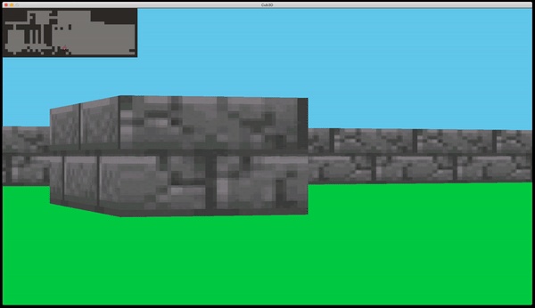

# `cub3d`

This project is inspired by Wolfenstein 3D, which was the first FPS ever.
It will enable you to explore ray-casting.
The objective was to make a dynamic view inside a maze, in which you'll have to find your way.



[Subject](en.subject.pdf)

## Instructions

* ```WASD``` to move
* ```Left/Right``` directional keys to rotate camera
* Move mouse to sides to also rotate camera
* ```ESC``` to quit


## Installation & Usage

Clone this repository to your computer:
```sh
git clone https://github.com/MatPizzolo/cub3d.git
```

First compile and install library
```sh
make
```

Run the game with a specific map file as argument.
```
./cub3D maps/git.cub
```

